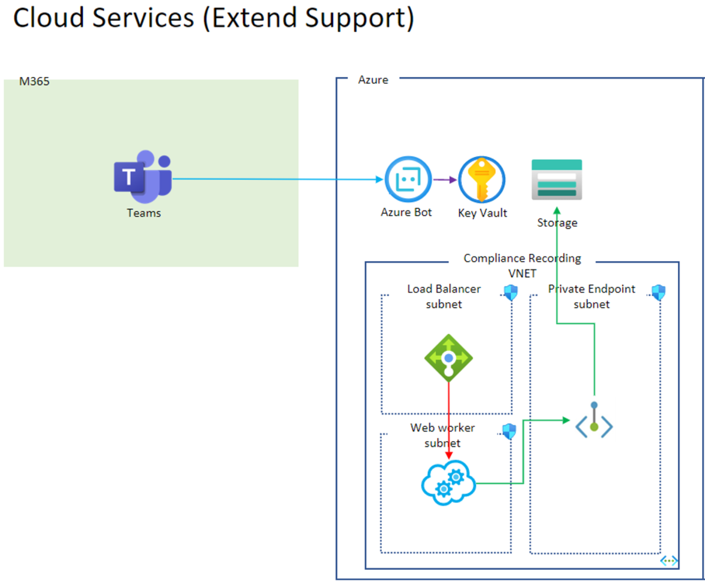

## Solution Overview

Refer the following image for architecture.

The **Custom Compliance Recording Bot** has the following main components:
* **Web API**: Create or Get Teams Online Meeting.
* **Azure Bot**: Call to recording bot.
* **Reaording Bot**: The Azure Cloud Services (extended support)for teams policy-based recording.(https://docs.microsoft.com/en-us/microsoftteams/teams-recording-policy)
* **Downloader App**: The Azure Key vault stores the secrets, certificates and connection strings. For more information about the data stored, please check [this](Data-stores.md).
* **Microsoft Graph API**: The app leverages Microsoft graph api's to [Create Online  Meeting](https://docs.microsoft.com/en-us/graph/api/application-post-onlinemeetings?view=graph-rest-1.0&tabs=csharp), [Get Online Meeting](https://docs.microsoft.com/en-us/graph/api/onlinemeeting-get?view=graph-rest-1.0&tabs=http), [Get User](https://docs.microsoft.com/en-us/graph/api/user-get?view=graph-rest-1.0&tabs=http).

---