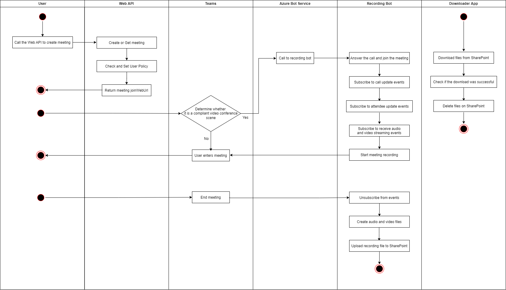

## Solution Overview

Refer the following image for architecture.

The **Custom Compliance Recording Bot** has the following main components:
* **Web API**: Create or Get Teams Online Meeting.
* **Azure Bot**: Call to recording bot.
* **Reaording Bot**: The Azure Cloud Services (extended support) for teams policy-based recording.(https://docs.microsoft.com/en-us/microsoftteams/teams-recording-policy)
* **Downloader App**: The Downloader App will download recording files to local from SharePoint.
* **Microsoft Graph API**: The app leverages Microsoft graph api's to [Create Online  Meeting](https://docs.microsoft.com/en-us/graph/api/application-post-onlinemeetings?view=graph-rest-1.0&tabs=csharp) , [Get Online Meeting](https://docs.microsoft.com/en-us/graph/api/onlinemeeting-get?view=graph-rest-1.0&tabs=http) , [Get User](https://docs.microsoft.com/en-us/graph/api/user-get?view=graph-rest-1.0&tabs=http)

---

## Flow chart

Following description of solution components workflows and how they interact with each other for core scenarios.

### CreateMeeting Web API

User calls the CreateMeeting API to create a online meeting and set the primary user to the compliance recording policy.

### Azure Bot Service

Teams platform will dial the recording bot through the call settings of this azure bot service so that the bot can anser call to join the meeting.

### Recording Bot

After joining the meeting, bot will subscribe meeting event and automatically start recording, save the recording files after meeting end, and upload recording files to specified SharePoint location.

### Downloader App

Download meeting recording files from specified SharePoint location.

---