# Deployment Guide

## Azure Portal (https://portal.azure.com/)

### Create Azure Bot
>**Note:** Record the bot name

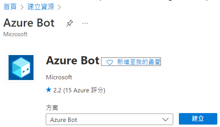

### Create bot channel - Microsoft Teams

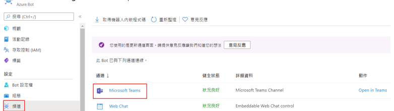

* Enable the calling
* Set webhook

### Create Key Vault

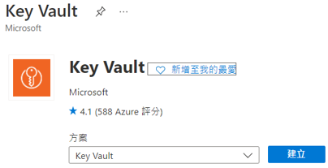

* Import the SSL certificate PFX file

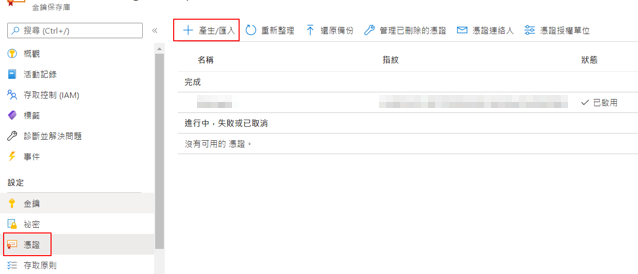

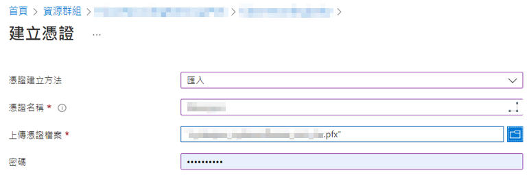

* Copy certificate thumbprint
>**Note:** Record the certificate thumbprint

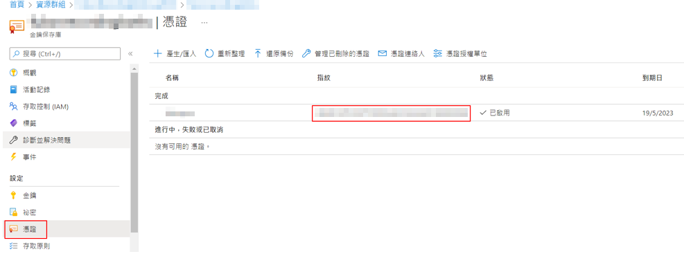

* Set access principles

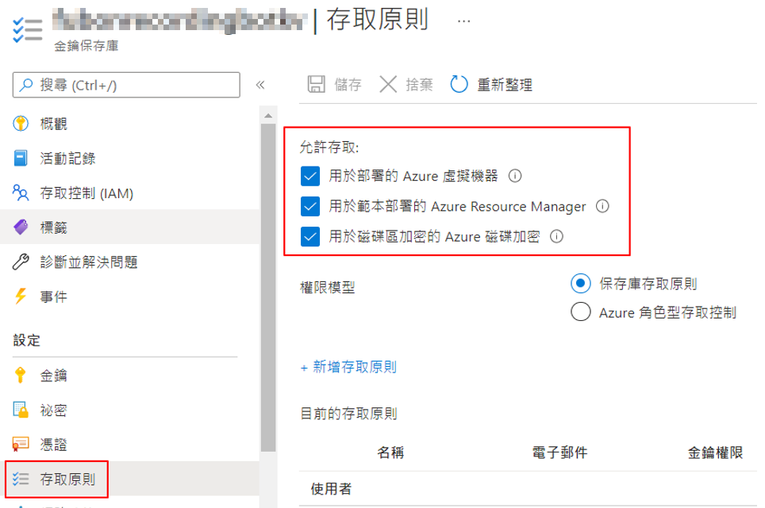

### Create Storage Account
>**Note:** Record the storage account name

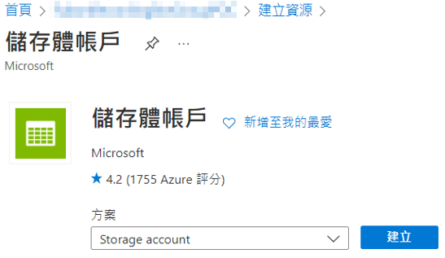

* Copy blob service endpoint
>**Note:** Record the blob service endpoint

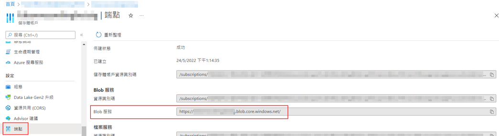

* Copy access key
>**Note:** Record the access key

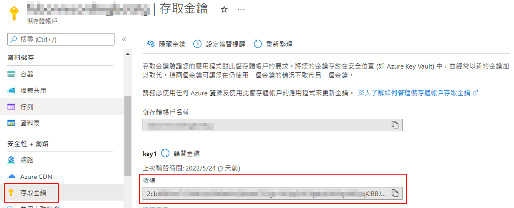

## Azure AD
### Application registration
>**Note:** Record the application name、app id

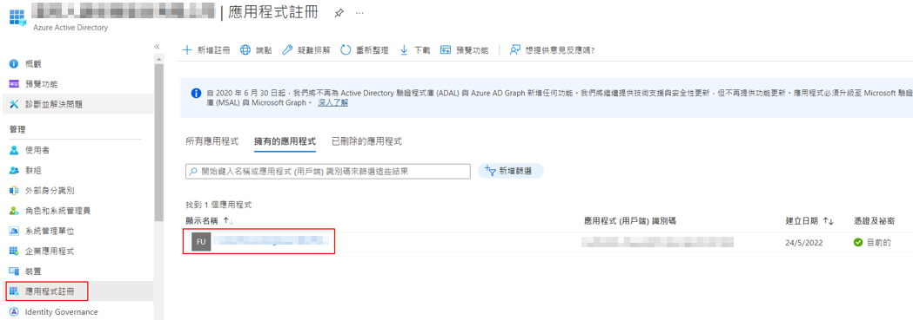

* Add AppSecret and copy value
>**Note:** Record the app secret

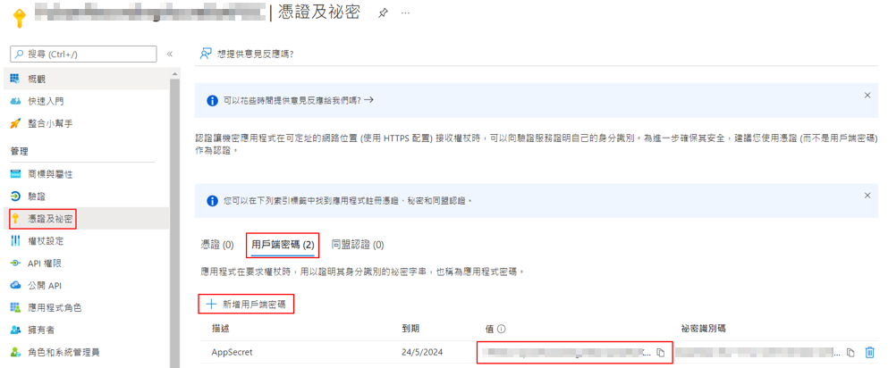

* Add API permissions - Microsoft Graph

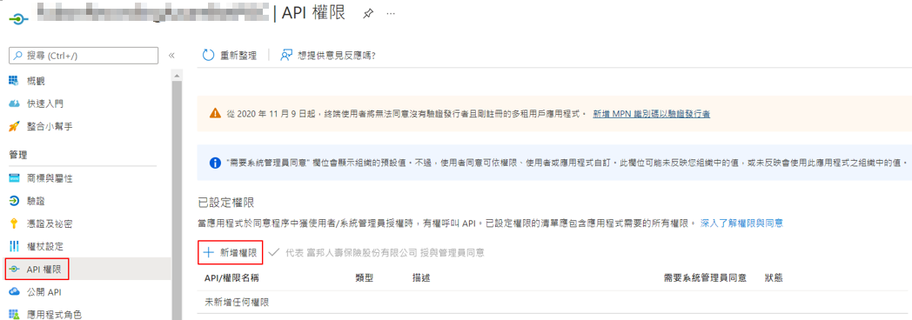

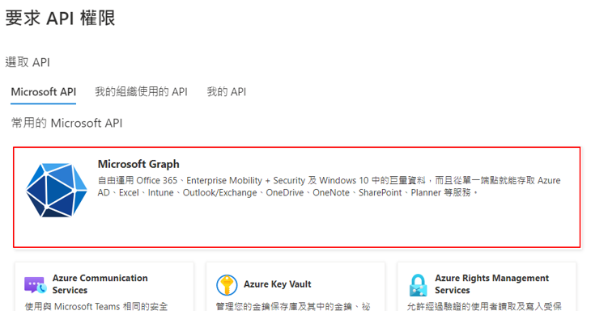

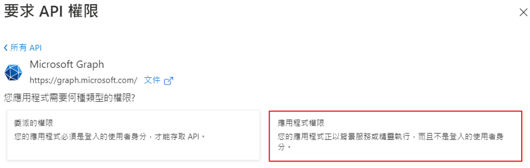

* Grant administrator consent

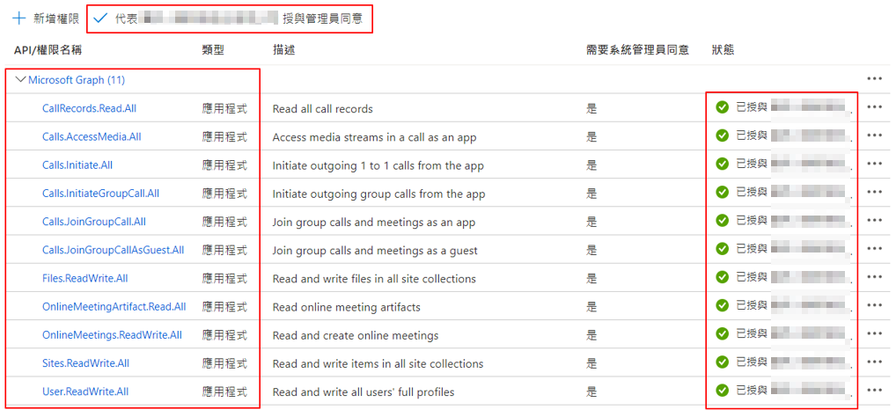

### Create users
>**Note:** Record the MeetingOrganizer user object id

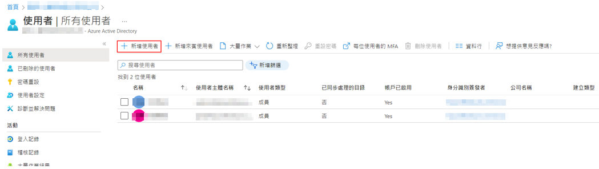

## M365 Admin Center (https://admin.microsoft.com/)
### Grant the user authorization
