# Deployment Guide

## Azure Portal (https://portal.azure.com/)

### Create Azure Bot
>**Note:** Record the bot name

### Create bot channel - Microsoft Teams

* Enable the calling and set webhook

### Create Key Vault

* Import the SSL certificate PFX file

* Copy certificate thumbprint
>**Note:** Record the certificate thumbprint

* Set access principles

### Create Storage Account
>**Note:** Record the storage account name

* Copy blob service endpoint
>**Note:** Record the blob service endpoint

* Copy access key
>**Note:** Record the access key

## Azure AD
### Application registration
>**Note:** Record the application name、app id

* Add AppSecret and copy value
>**Note:** Record the app secret

* Add API permissions - Microsoft Graph

* Grant administrator consent

### Create users
>**Note:** Record the MeetingOrganizer user object id

## M365 Admin Center (https://admin.microsoft.com/)
### Grant the user authorization

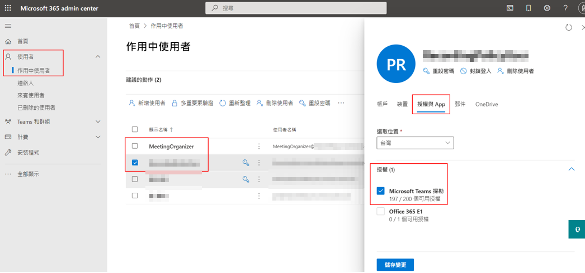

## Power Shell (executed as an administrator)
[Please refer to Power Shell](https://github.com/shawnlien/CustomComplianceRecordingBot/blob/main/Wiki/PowerShell.md)

## Teams Admin (https://admin.teams.microsoft.com/)
### Add users to the teams channel

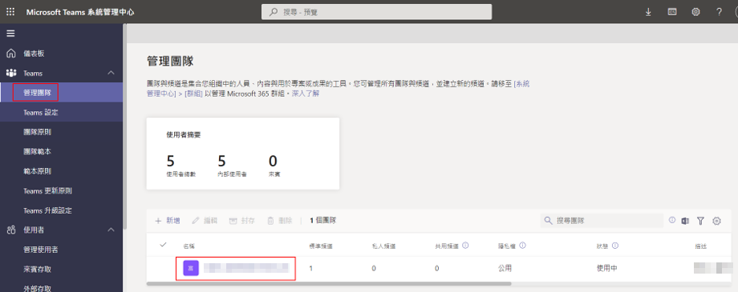

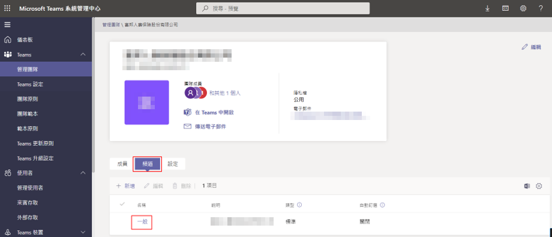

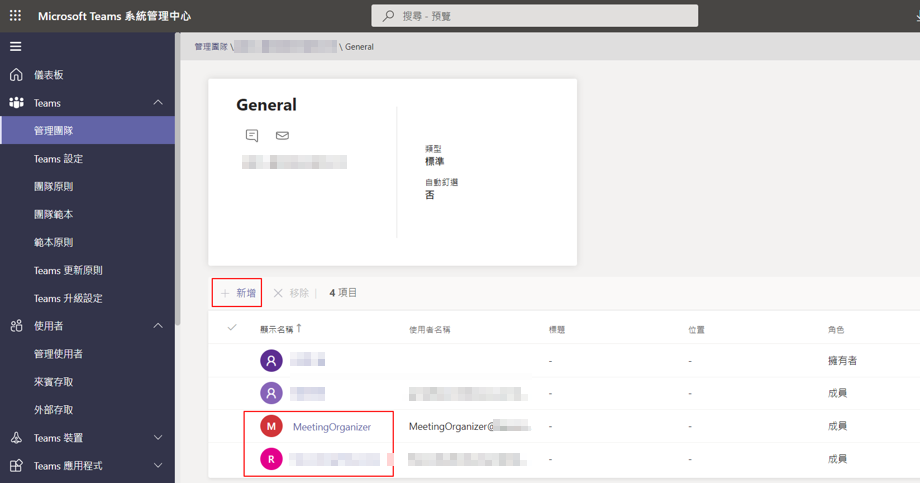

## Teams (https://teams.microsoft.com/)
### Get ChannelId
>**Note:** Record the ChannelId

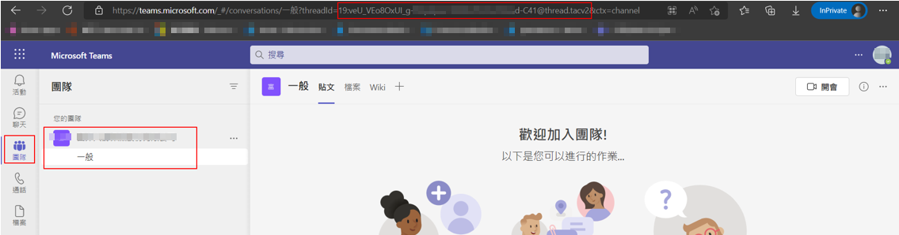

## Share Point (https://xxxxxx.sharepoint.com/)
### Get the SiteId
>**Note:** Record the SiteId

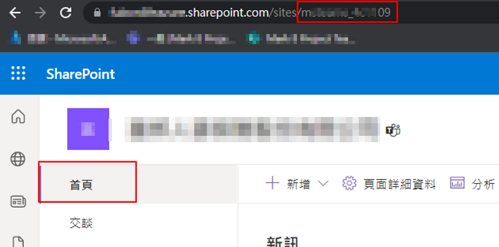

### Create recordings folder (/General/Recordings)

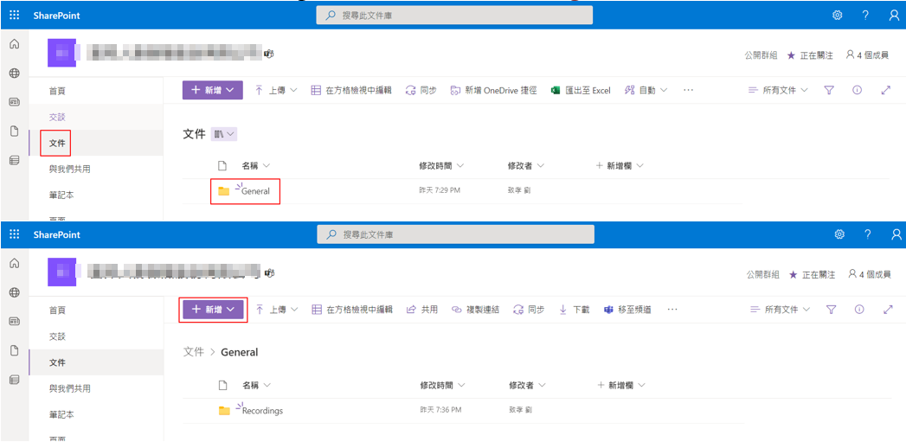

## Source Code
### Modify \Source\BotService\LocalMedia\ComplianceRecordingBot\ServiceConfiguration.Cloud.cscfg
### Modify \Source\BotService\LocalMedia\ComplianceRecordingBot\ServiceConfiguration.Local.cscfg
### Modify \Source\BotService\LocalMedia\ComplianceRecordingBot\WorkerRole\ComplianceRecordingBot.WorkerRole.dll.config

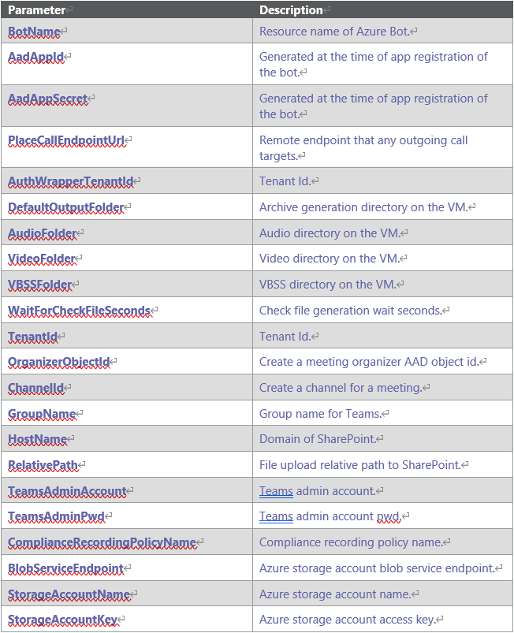

## Visual Studio
### Release of Cloud Service (Extended Support)

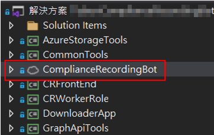

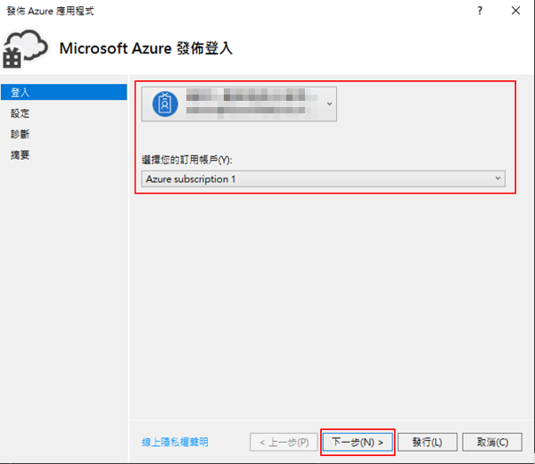

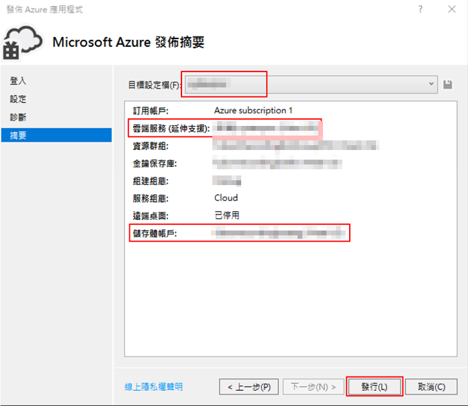

## Copy the files into the VM and install them
* VC_redist.x64.exe
* PowerShell-7.2.2-win-x64.msi

### Execute PowerShell
* Install module: 
Install-Module -Name MicrosoftTeams -Force -AllowClobber

* Import Module: 
Import-Module MicrosoftTeams

* Get the module installation path: 
Get-Module -ListAvailable -Name MicrosoftTeams

* Add the module installation path to the system environment variable

* Restart the VM
