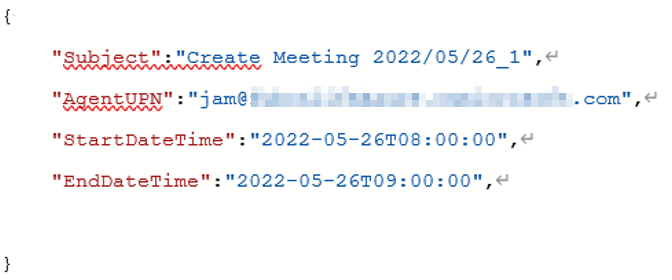
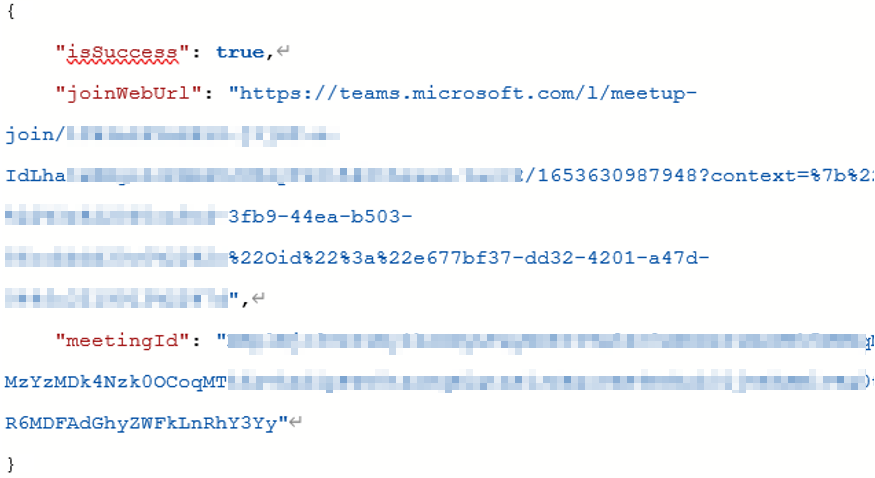
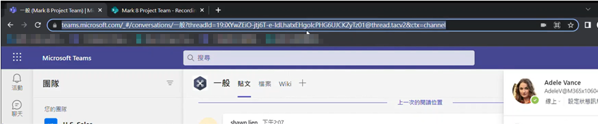
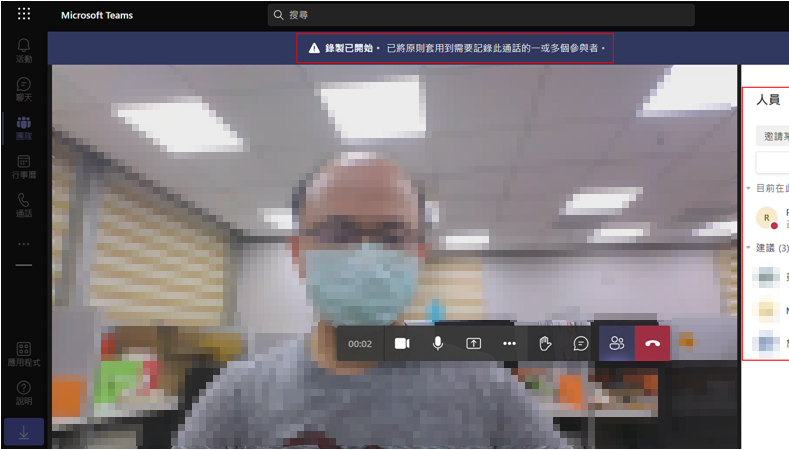
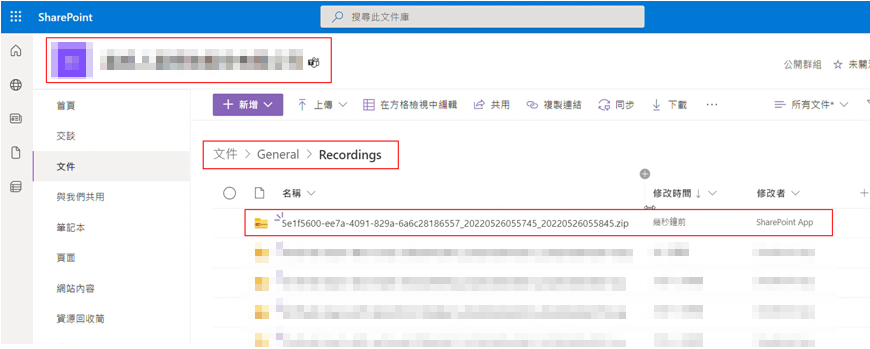
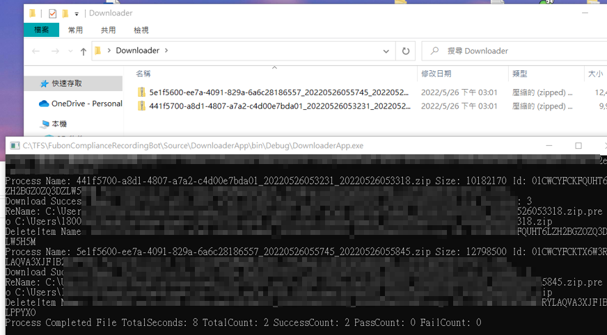

# Test Guide

## Call Web API to  get the teams meeting link.

* Request

* Response

## Use ths joinWebUrl to join the Meeting.

## Meeting recording will auto start.

## Recording files will upload to SharePoint when the meeting ends.

## Execute DownloaderApp to move recording files to designated file server.

